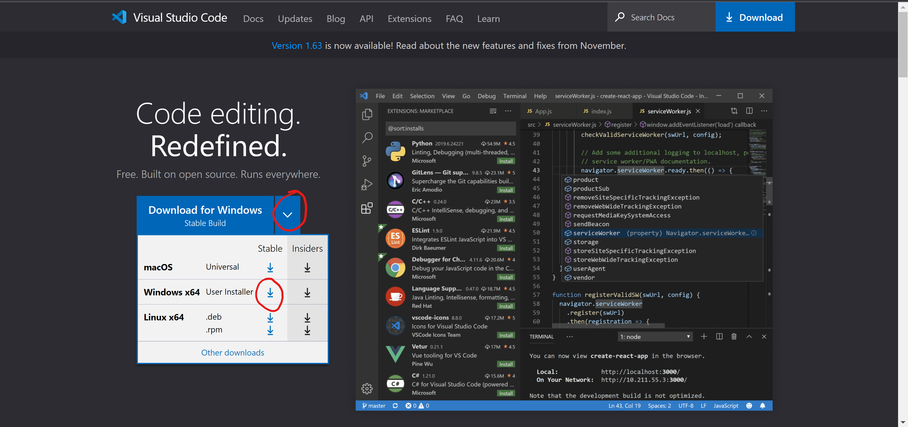
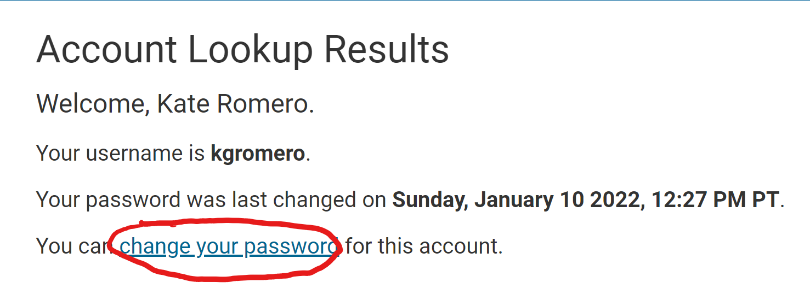
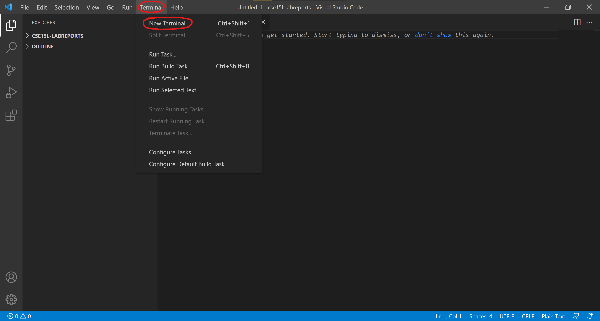
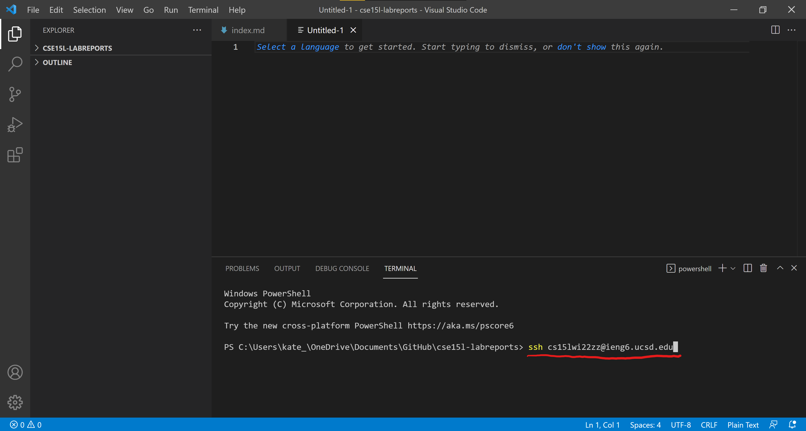
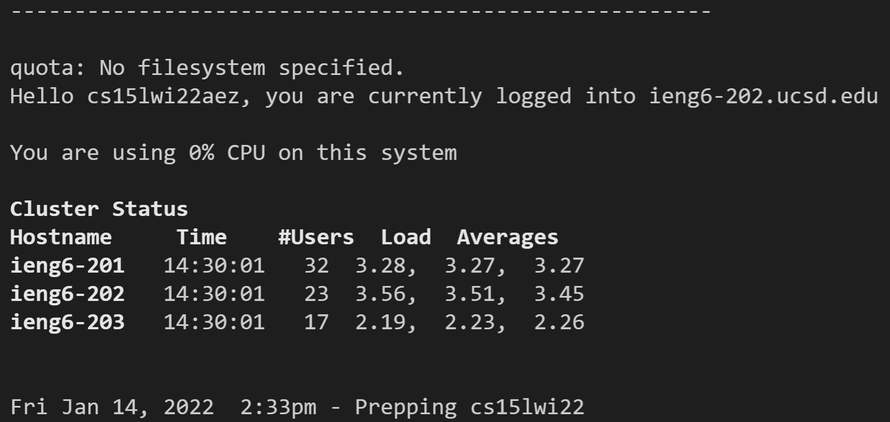
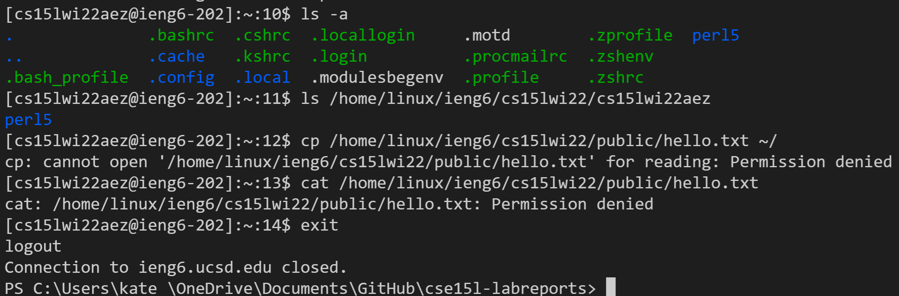
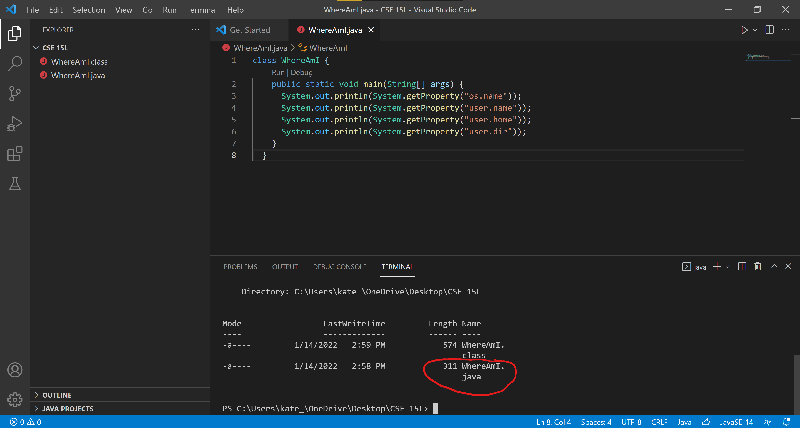
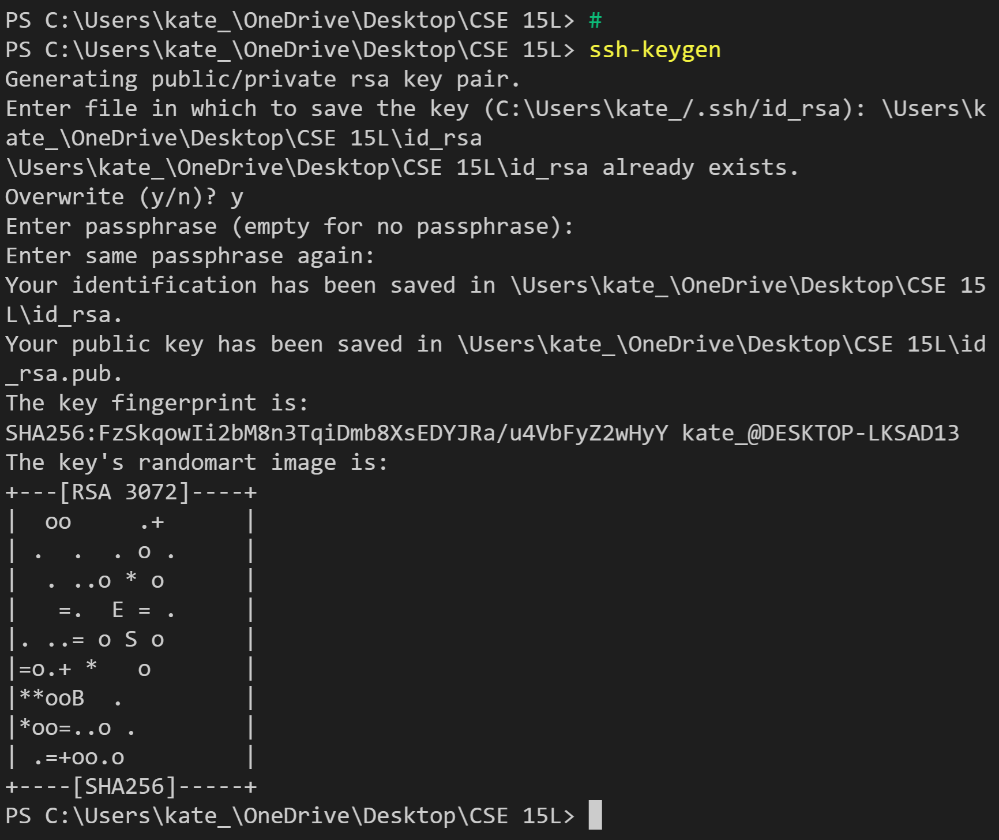
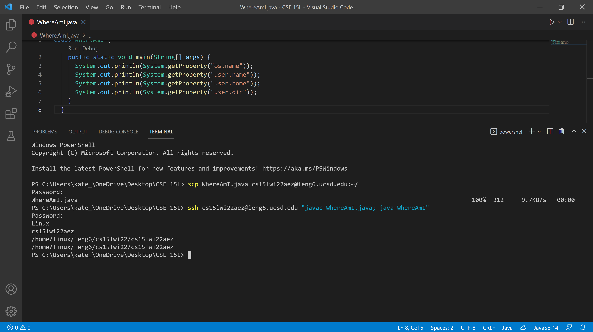

# CSE 15l: Lab 1 *for Windows*   
## Installing VSCode  
1. Click [this link](https://code.visualstudio.com/)  
2. Select the drop down arrow and select the appropriate download icon.  
  
## Remotely Connecting  
### Resetting Your Password  
1. Click [this link](https://docs.microsoft.com/en-us/windows-server/administration/openssh/openssh_install_firstuse) and follow the directions to install OpenSSH.  
2. Click [this link](https://sdacs.ucsd.edu/~icc/index.php) and log in.  
3. Take note of your username for this course. It will look simmilar to `cs15lwi22zz`  
4. Select `change your password`  
  
5. Enter your username and select `continue`  
6. Select `I know my current AD password and would like to change it.`  
7. Login to active directory  
8. Enter your current and new passwords and select `CHANGE PASSWORD`  
### Connecting to the Remote Server Through VSCode
1. Open VSCode  
2. Click `Terminal` at the top of the page, then select `New Terminal`  
  
3. Inside the terminal, type `ssh cs15lwi22zz@ieng6.ucsd.edu` (replace `zz` with the letters unique to your course username) and press enter  
  
4. If this is your first time connecting to the remote server, you will see a confirmation message. Type `yes` and press enter.  
5. You should see something similar to the picture below. You are now connected to ieng6!  
  
## Trying Some Commands
Try running some commands through the remote server by typing them into the terminal. The following is a list of some commands.  
`cd ~`  
`cd`  
`ls -lat`  
`ls -a`  
`ls /home/linux/ieng6/cs15lwi22/cs15lwi22zz` (replace zz)  
`cp /home/linux/ieng6/cs15lwi22/public/hello.txt ~/`  
`cat /home/linux/ieng6/cs15lwi22/public/hello.txt`  
  
## Moving Files with `scp`  
1. Type `exit` and press enter to exit the remote server  
2. Create a file named `WhereAmI.java`, open it in VSCode, and copy/paste the following code into it:
``class WhereAmI {
  public static void main(String[] args) {
    System.out.println(System.getProperty("os.name"));
    System.out.println(System.getProperty("user.name"));
    System.out.println(System.getProperty("user.home"));
    System.out.println(System.getProperty("user.dir"));
  }
}``  
3. Save the file and open a terminal  
4. In the terminal, type `scp WhereAmI.java cs15lwi22zz@ieng6.ucsd.edu:~/` and press enter  
5. When prompted, enter your password  
6. The file has now been copied to the remote server! It will now be listed when you type run the `ls` command in ieng6. You can now run `WhereAmI.java` through ieng6 when logged in.  
  
## Setting an SSH Key  
Follow the directions in [this link](https://docs.microsoft.com/en-us/windows-server/administration/openssh/openssh_keymanagement#user-key-generation)  
Your key's randomart image should look similar to the following:  
  
You can now connect to ieng6 without a password!  
## Optimizing Remote Running  
Tips and tricks to go even faster  
* Press the `up arrow` on your keyboard while in the terminal to select a previous command  
* Write a command in quotes at the end of an `ssh` comman in quotes to run it on the remote server and then exit  
* Use semicolons to run multiple commands on the same line  
* Keep a document with the commands you use most often (copy and paste into terminal)  

Without using any tips or tricks, copying a change in `WhereAmI.java` to ieng6 and running it remotely took 61.31 seconds and 115 keystrokes.  

Using the a combination of the tips and tricks and the SSH Key allowed me to complete the same process in 10.01 seconds using only 7 keystrokes.  

