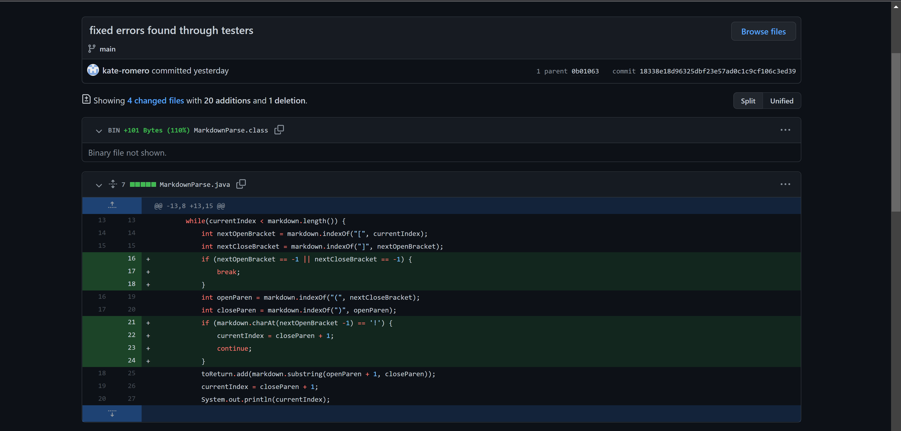
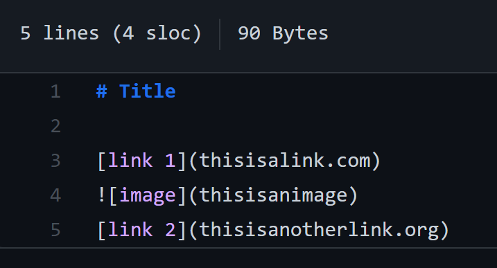
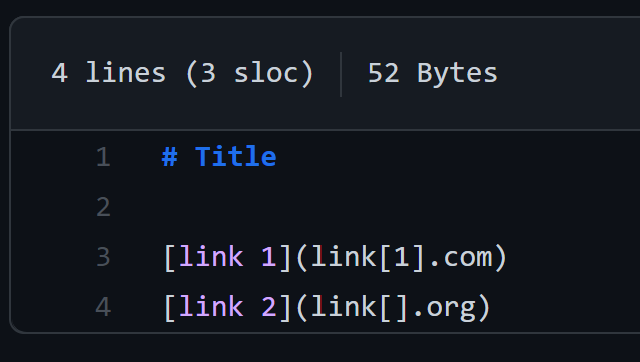
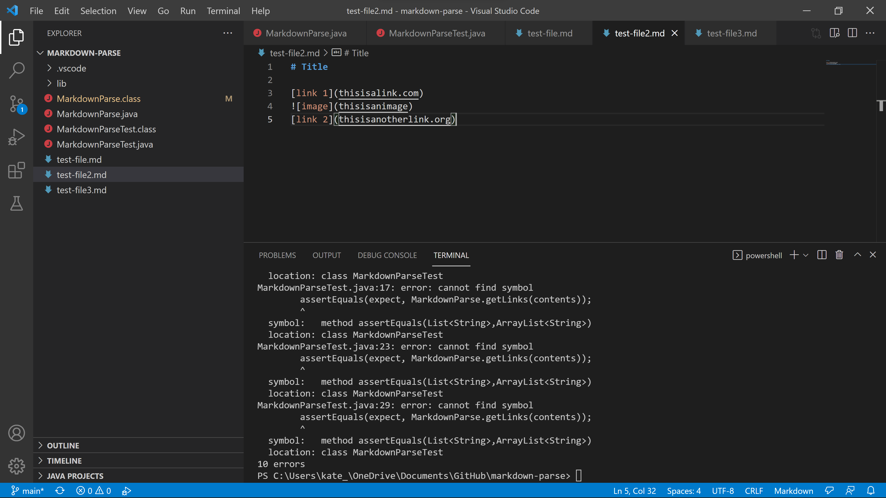

# Week 4: Lab Report 2  
  
(all code changes shown above)  

Failure inducing [input_1](https://github.com/kate-romero/markdown-parse/blob/main/test-file2.md?plain=1)  
  
Failure inducing [input_2](https://github.com/kate-romero/markdown-parse/blob/main/test-file3.md?plain=1)  
  

Symptoms of failure inducing inputs
  
(During lab, I was able to run the commands. After, I got this compilation error. I think it is because I am using windows and can only find the mac/linux commands)  

Symptom of input 1: It printed the image adress as though it were a link.  
Symptom of input 2: It entered an infinite loop.  

The bugs in the `MarkdownParse.java` file caused the failure-inducing input to exhibit their resepctive symptoms when tested. This symptom lead us to re-examine the code and add if statements so that the code could properly handle these test cases and other cases that fall within the same categories.