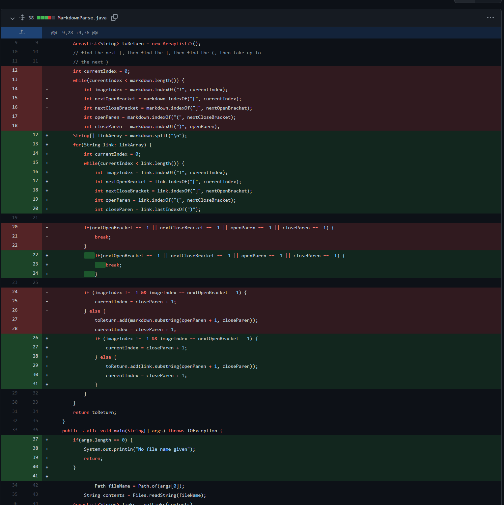

# Week 4: Lab Report 2  
## Bug/input 1: `brokenLink.md`  
  
[link to brokenLink.md test file](https://github.com/kate-romero/my-markdown-parse/blob/main/brokenLink.md?plain=1)  
  
The bug was that our code did not account for incorrectly written links. Because of this bug, running `MarkdownParse` on brokenLink.md caused the program to enter an infinite loop. This symptom alerted us to re-examine our code to find and fix the bug that allowed the brokenLink.md input to be failure-inducing by breaking if a bracket or parenthesis cannot be found.  
  
## Bug/input 2: `imageLink.md`  
  
[link to imageLink.md test file](https://github.com/kate-romero/my-markdown-parse/blob/main/imageLink.md?plain=1)  
  
The bug was that our code did not account for images by checking if a possible link was preceded by a `!` and, if it was, skipping over it. Because of this bug, running `MarkdownParse` on imageLink.md caused an image link to be printed as though it were a regular link. This symptom alerted us to re-examine our code to find and fix the bug that allowed the imageLink.md input to be failure-inducing.  
  
## Bug/input 3: `linkParentheses.md`  
  
[link to linkParentheses.md test file](https://github.com/kate-romero/my-markdown-parse/blob/main/linkParentheses.md?plain=1)  
  
The bug was that our code did not account for links containing a `)`. Because of this bug, running `MarkdownParse` on linkParentheses.md only printed the part of the link preceding the first `)` inside the link. This symptom alerted us to re-examine our code to find and fix the bug that allowed the imageLink.md input to be failure-inducing.  