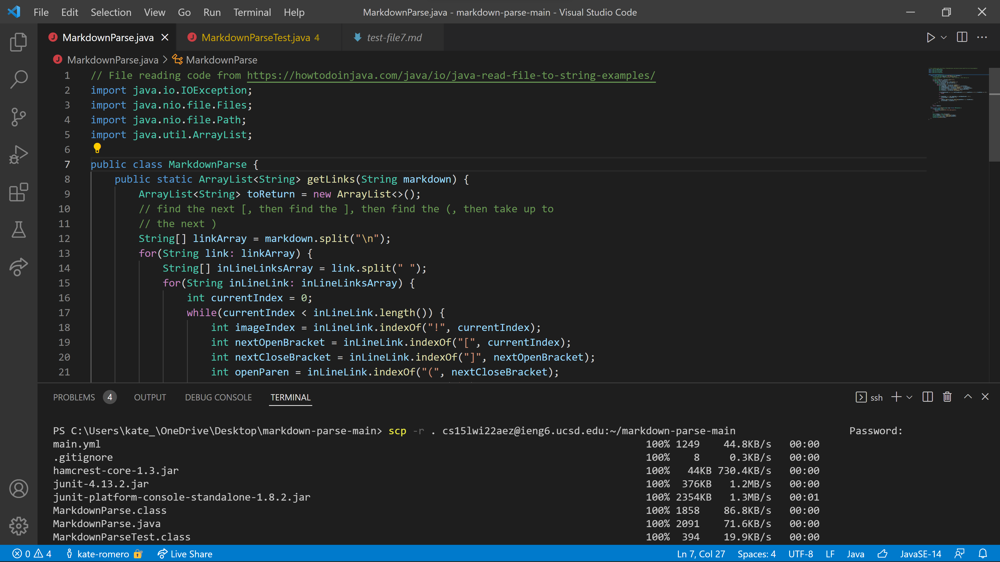

# Week 6: Lab Report 3  
## Copy Whole directories with `scp -r`  
  
### Copying whole markdown-parse directory to my ieng6 account  
  

### Logging into my ieng6 account after copying the directory and compiling and running the tests for my repository  
  

### Combining `scp`, `;`, and `ssh` to copy the whole directory and run the tests in one line  
(took two tries because I forgot to include cd the first time)  

