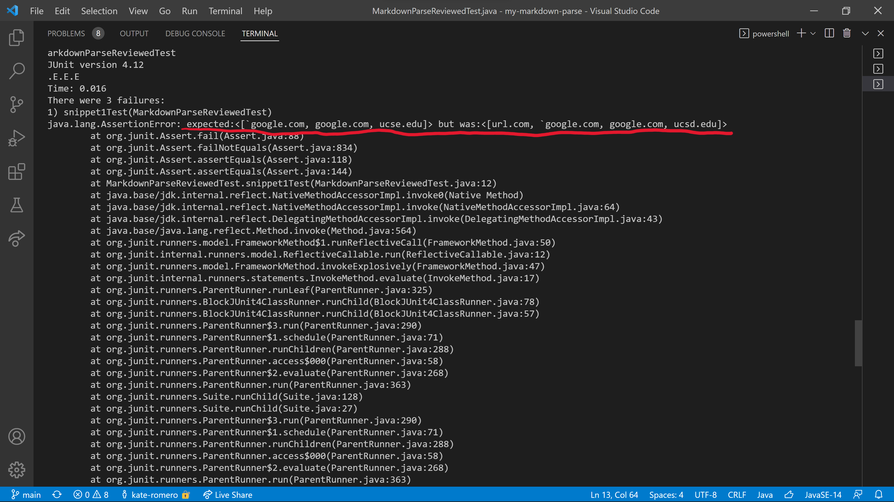

# Week 8: Lab Report 4  
## Repository Links for markdown-parse  
- [my repository](https://github.com/kate-romero/my-markdown-parse)  
- [the repository my group reviewed](https://github.com/Stocktocon/markdown-parse)  
  
## Testing and Output
### Tests
- testers for my group's code:  
  
- testers for the code my group reviewed:  
  
### Output
- output of my group's code:  
  
  
  
None of the tests passed. The mistakes in our output are written in red.  
- output of the code my group reviewed:
  
  
  
None of the tests passed, but they came closer than we did. The mistakes in their output are written in red.  
  
## Questions
1) Snippet 1: I think a small code change could make our program work for snippet 1 and related cases. I think it would involve prioritizing sets of [] and () by ignoring sets of '' and "" that start or finish inside a set of [] or ().  
  
2) Snippet 2: I think a small code change could make our program work for snippet 2 and related cases. We can do this by searching for the last ] before the next ( and the last ) before the next [, instead of just searching for the first of each symbol.  
  
3) Snippet 3: I do not think a small code change could make our program work for snippet 3 and related cases. This is because our entire program relies on an array of strings created by splitting at each new line. We would have to change our underlying data structure to handle links that take up more than one line.