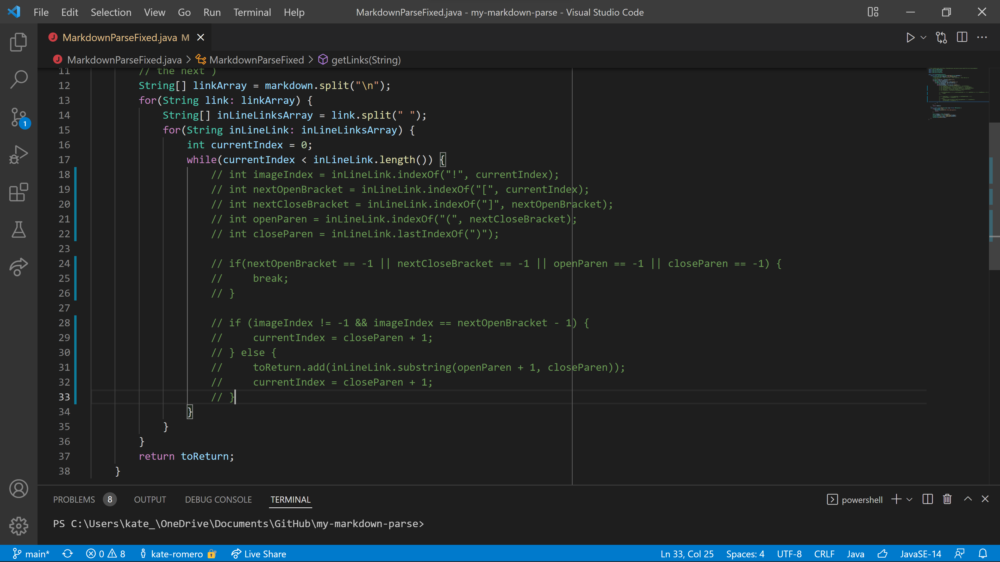
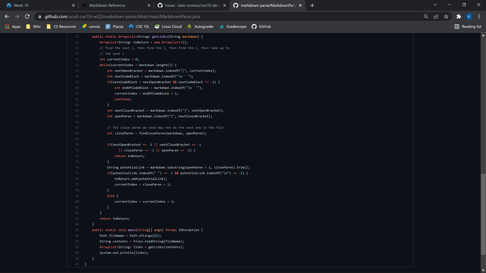

# Lab 5  
I found the tests by searching through manually.  
## Test 512:
```
[link] bar](/uri)
```
Given Output: `[/uri]`  
My Output: An infinite loop.  
Neither implementation is correct because the expected output is `[]`.  
While working on another part of my implementation, I had commented out my while loop. I can fix this bug by undoing the //.  
  
## Test 516
```
[](/uri)
```
Given Output: `[moon.jpg]`  
My Output: `[/uri]`  
My implementation is correct because the expected output is `[/uri]`.  
The bug in the Given implementation could be fixed by continuing to search for a link after determining that there is a nested image.  
  
